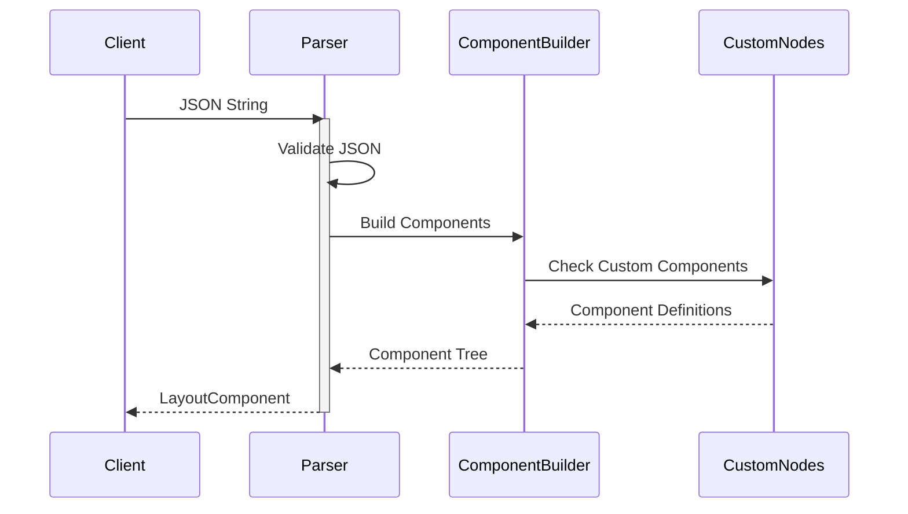

# Compose Remote Layout

## 1. Background and Motivation

In modern app development, the ability to update UI components without deploying new app versions is
increasingly important. While solutions like React Native and Flutter offer this capability, they
often require learning new frameworks or languages. Compose Remote Layout bridges this gap for
Kotlin Multiplatform applications by enabling dynamic UI updates while staying within the Compose
ecosystem.

This library was created to solve several key challenges:

- The need for rapid UI iterations without app store submissions
- A/B testing requirements for UI components
- Platform-specific UI customization from a central source
- Real-time UI updates for critical changes

## 2. Key Features

The compose-remote-layout module provides several core features:

1. **Component System**
    - Built-in support for basic Compose components (Column, Row, Box, Text, Button, Card)
    - All components can be defined and modified through JSON
    - Component properties map directly to Compose parameters

2. **Dynamic Updates**
    - Load layouts from remote sources (API, Firebase, local files)
    - Update UI without app redeployment
    - Handle layout changes in real-time

3. **Value Binding**
    - Dynamic text updates using the BindsValue system
    - Template-based value substitution
    - Real-time value changes support

4. **Modifier System**
    - Comprehensive modifier support matching Compose capabilities
    - Scoped modifiers for specific component types
    - JSON-based modifier definition

5. **Custom Components**
    - Register custom Composable functions
    - Map JSON definitions to custom UI elements
    - Pass custom parameters and handle specific logic

## 3. Download

Add the dependencies to your `build.gradle.kts`:

```kotlin
// Kotlin Multiplatform
implementation("io.github.utsmannn:compose-remote-layout:0.0.1-alpha01")

// Choose platform-specific implementations as needed:
implementation("io.github.utsmannn:compose-remote-layout-android:0.0.1-alpha01")
implementation("io.github.utsmannn:compose-remote-layout-jvm:0.0.1-alpha01")
implementation("io.github.utsmannn:compose-remote-layout-iosx64:0.0.1-alpha01")
implementation("io.github.utsmannn:compose-remote-layout-iosarm64:0.0.1-alpha01")
implementation("io.github.utsmannn:compose-remote-layout-js:0.0.1-alpha01")
```

## 4. Usage Guide

### 4.1 Default Usage

Basic implementation using built-in components:

```kotlin
@Composable
fun MyScreen(layoutJson: String) {
    val layoutComponent = remember(layoutJson) {
        LayoutParser.parseLayoutJson(layoutJson)
    }

    DynamicLayout(
        component = layoutComponent,
        onClickHandler = { clickId ->
            // Handle click events
        }
    )
}
```

Example JSON layout:

```json
{
  "column": {
    "modifier": {
      "base": {
        "fillMaxWidth": true,
        "padding": {
          "all": 16
        }
      }
    },
    "children": [
      {
        "text": {
          "content": "Hello World"
        }
      }
    ]
  }
}
```

### 4.2 Custom Node Registration

Create and register custom components:

```kotlin
// Register during app initialization
CustomNodes.register("banner") { param ->
    Column(
        modifier = param.modifier
    ) {
        Text(
            text = param.data["title"] ?: "unknown",
            style = MaterialTheme.typography.h2
        )
        Spacer(Modifier.height(8.dp))
        Text(
            text = param.data["message"] ?: "unknown"
        )
    }
}
```

Use in JSON:

```json
{
  "banner": {
    "data": {
      "title": "Welcome",
      "message": "This is a custom banner"
    },
    "modifier": {
      "base": {
        "padding": {
          "all": 16
        }
      }
    }
  }
}
```

### 4.3 Modifier System

The library supports extensive modifiers through JSON:

```json
"modifier": {
"base": {
"width": 200,
"height": 100,
"padding": {
"all": 16
},
"background": {
"color": "#FF0000",
"shape": "roundedcorner",
"radius": 8
}
}
}
```

### 4.4 Scoped Modifiers

Different components support specific modifiers:

```json
// Column-specific modifiers
{
  "column": {
    "modifier": {
      "base": {
        "fillMaxWidth": true
      },
      "verticalArrangement": "spaceBetween",
      "horizontalAlignment": "center"
    }
  }
}

// Row-specific modifiers
{
  "row": {
    "modifier": {
      "horizontalArrangement": "spaceBetween",
      "verticalAlignment": "center"
    }
  }
}
```

# 5. How It Works

The library operates through several interconnected systems that handle JSON parsing, component
rendering, and state management. Let's explore how each part works.

## 5.1 Core Flow

The basic flow of the library follows this sequence:


Implementation example:

```kotlin
@Composable
fun MyScreen() {
    val jsonLayout = """
    {
      "column": {
        "children": [
          {
            "text": {
              "content": "Hello World"
            }
          }
        ]
      }
    }
    """

    val component = LayoutParser.parseLayoutJson(jsonLayout)
    DynamicLayout(component = component)
}
```

## 5.2 JSON Parsing and Component Creation

Here's how the library processes JSON into UI components:



Example of handling parsed layouts:

```kotlin
@Composable
fun LayoutScreen() {
    var layout by remember { mutableStateOf("") }

    LaunchedEffect(Unit) {
        layout = fetchLayoutFromServer()
    }

    val component = remember(layout) {
        LayoutParser.parseLayoutJson(layout)
    }

    DynamicLayout(component = component)
}
```

## 5.3 Value Binding System

The value binding system manages dynamic content updates:


Implementation example:

```kotlin
@Composable
fun CounterExample() {
    val bindsValue = remember { BindsValue() }
    var counter by remember { mutableStateOf(0) }

    LaunchedEffect(counter) {
        bindsValue.setValue("counter", counter)
    }

    Column {
        DynamicLayout(
            component = LayoutParser.parseLayoutJson(
                """
            {
              "text": {
                "content": "{counter}"
              }
            }
            """
            ),
            bindValue = bindsValue
        )

        Button(onClick = { counter++ }) {
            Text("Increment")
        }
    }
}
```

## 5.4 Custom Component Registration

The process for registering and using custom components:


Example implementation:

```kotlin
class MainActivity : ComponentActivity() {
    override fun onCreate(savedInstanceState: Bundle?) {
        super.onCreate(savedInstanceState)

        // Register custom component
        CustomNodes.register("banner") { param ->
            Column(modifier = param.modifier) {
                Text(param.data["title"] ?: "")
                Text(param.data["message"] ?: "")
            }
        }

        setContent {
            // Use custom component
            DynamicLayout(
                component = LayoutParser.parseLayoutJson(
                    """
                {
                  "banner": {
                    "data": {
                      "title": "Welcome",
                      "message": "Hello!"
                    }
                  }
                }
                """
                )
            )
        }
    }
}
```

## 5.5 Event Handling Flow

The event system handles user interactions:


Implementation example:

```kotlin
@Composable
fun ButtonExample() {
    DynamicLayout(
        component = LayoutParser.parseLayoutJson(
            """
        {
          "button": {
            "content": "Click Me",
            "clickId": "main_button"
          }
        }
        """
        ),
        onClickHandler = { clickId ->
            when (clickId) {
                "main_button" -> {
                    // Handle click
                }
            }
        }
    )
}
```

## 5.6 Layout Updates and Caching

Updates and caching flow:


Example with remote updates:

```kotlin
@Composable
fun DynamicUpdates() {
    var layout by remember { mutableStateOf("") }

    LaunchedEffect(Unit) {
        while (true) {
            delay(5000)
            layout = fetchNewLayout()
        }
    }

    DynamicLayout(
        component = LayoutParser.parseLayoutJson(layout)
    )
}
```

## 6. Sample Projects

### Firebase Remote Config Integration

The repository includes a Firebase sample project demonstrating:

1. **Remote Config Setup**: Integration with Firebase Remote Config
2. **Real-time Updates**: Layout updates without app deployment
3. **Cross-platform Support**: Implementation for Android and iOS
4. **Error Handling**: Fallback mechanisms and error states

Key implementation points:

```kotlin
// iOS implementation
LaunchedEffect(Unit) {
    FIRApp.configure()
    val remoteConfig = FIRRemoteConfig.remoteConfig()
    remoteConfig.configSettings = FIRRemoteConfigSettings().also {
        it.minimumFetchInterval = 1.0
    }

    remoteConfig.addOnConfigUpdateListener { configUpdate, error ->
        if (configUpdate != null) {
            remoteConfig.fetchAndActivate()
        }
    }
}
```

## 7. JSON Builder Guide

### 7.1 Using jsonBuilderWeb Module

The jsonBuilderWeb module provides a web interface for:

- Creating and editing layouts
- Real-time preview of changes
- Schema validation
- Remote config integration

To run the JSON builder:

```shell
./gradlew :jsonBuilderWeb:jsBrowserRun
```

### 7.2 Firebase Remote Config Integration

The `remote-config-server` in the jsonBuilderWeb module provides:

- Local development server for testing
- Firebase Remote Config simulation
- API endpoints for layout updates
- Configuration management interface

## 8. Potential Use Cases

This library can handle various scenarios:

1. **A/B Testing**
    - Test different layouts with user segments
    - Gather metrics on UI performance
    - Quick iteration on designs

2. **Dynamic Content**
    - Seasonal UI changes
    - Feature announcements
    - Promotional content

3. **Platform Customization**
    - Platform-specific layouts
    - Device-specific optimizations
    - Regional variations

4. **Rapid Iterations**
    - Quick fix for UI issues
    - New feature rollouts
    - Experimental features

## 9. Important Disclaimer

⚠️ **Early Development Stage**

This library is currently in alpha stage (version 0.0.1-alpha01) and has several important
considerations:

1. **Production Use**: Not recommended for production applications at this time
2. **API Stability**: The API may change significantly between versions
3. **Performance**: Not fully optimized for large-scale applications
4. **Testing**: Limited real-world testing and validation
5. **Documentation**: May be incomplete or subject to changes

We recommend:

- Using this library for experimental projects
- Contributing feedback and bug reports
- Waiting for stable releases before production use
- Testing thoroughly in your specific use case

Please report issues and suggestions through the GitHub repository.